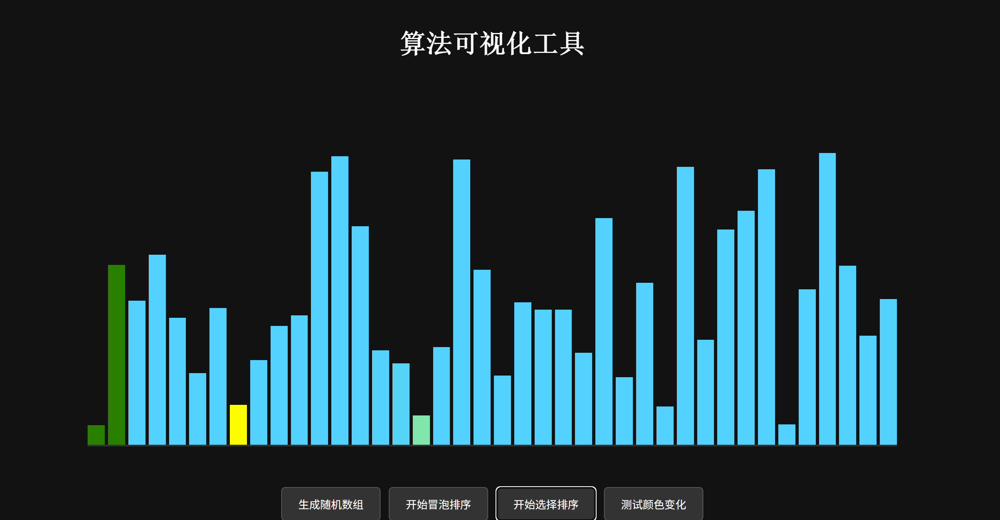
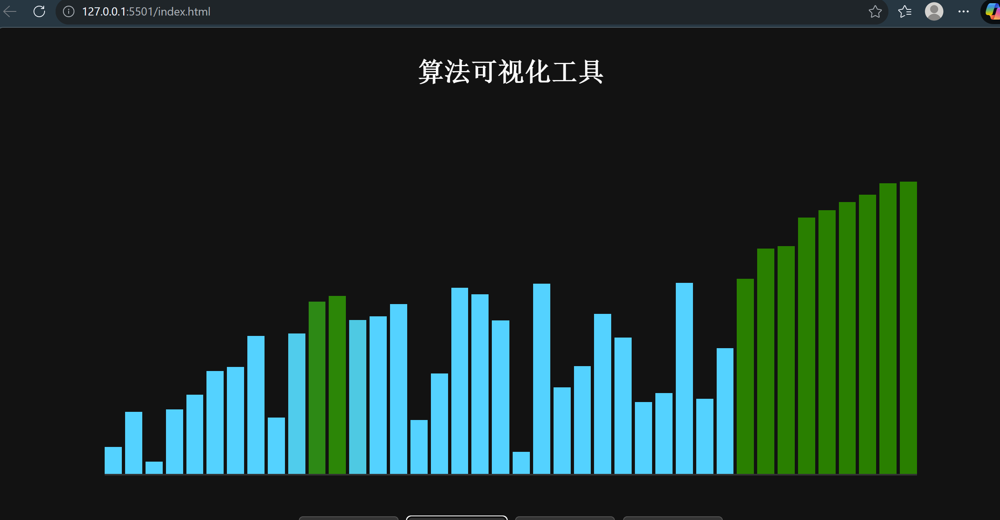

# 算法可视化工具
## 介绍
本工具旨在于使用柱状图动态表示算法，使得其得以可视化，目前已完成冒泡排序可视化，选择排序可视化和插入排序可视化，同时加入了可视化速度调整模块。
## 使用语言
html；css；JavaScript
## 主要特点与开发目的
从代码可视化算法；
了解算法；
旨在于让算法学习变得更加轻松便捷
## 使用界面
# 排序部分
选择排序：
<<<<<<< HEAD

冒泡排序：

插入排序：

# 数据结构部分
已开发队列的可视化。

## 后续功能会加入更多的功能，尽可能将所有算法做到可视化。
=======
